### Начало

Для начала создал репу, закинул туда всю начальную структуру, добавил ветку для разработки и защитил основную ветку main.

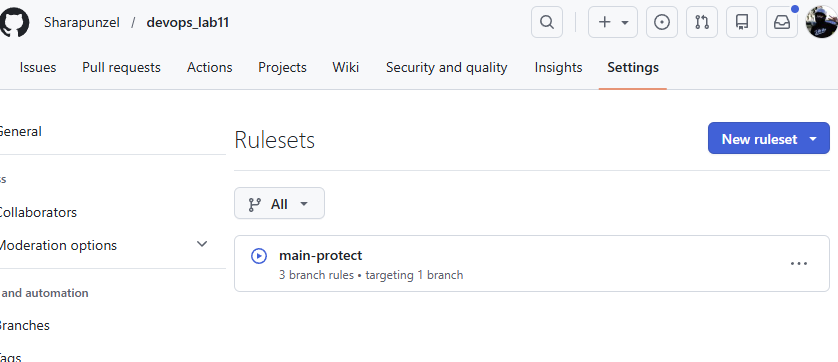

### Добавление Actions и отладка приложения

Линтеры и тесты прошли неудачно, нужно отладить
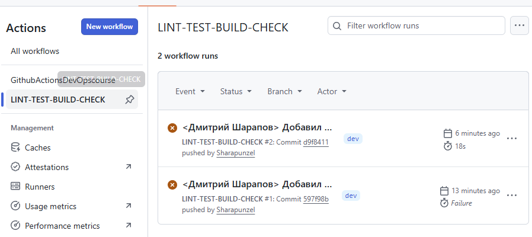
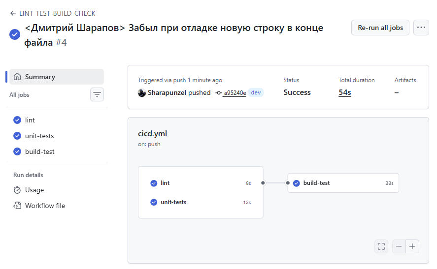

### Куберизация

Собрал образ локально
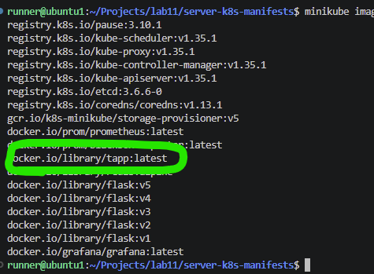

Сделал токен и добавил в репу
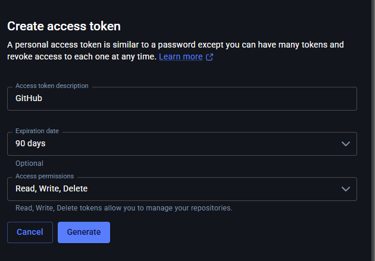
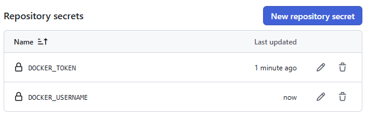

Добавил новый воркфлоу, отладил его и обнаружил образ в моем репо на докерхабе
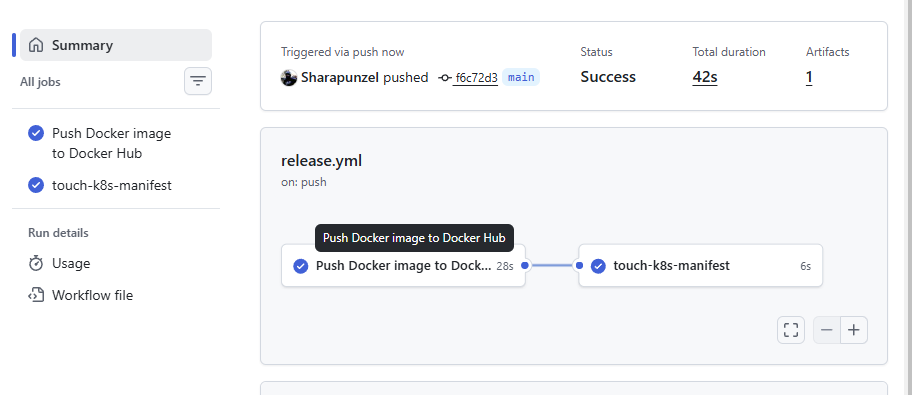
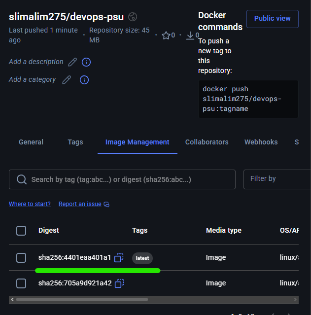

### ArgoCD

Установка
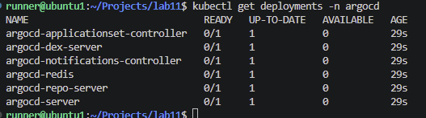
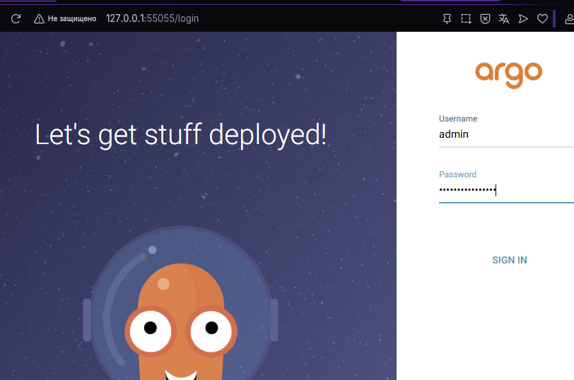

Подключил к репе
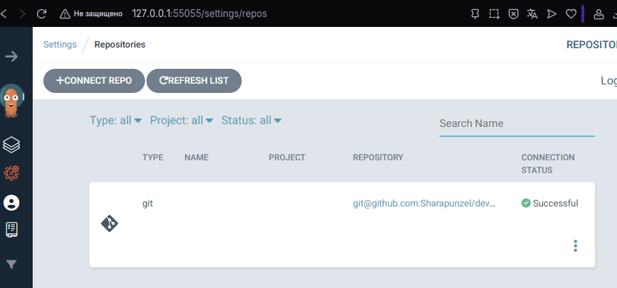
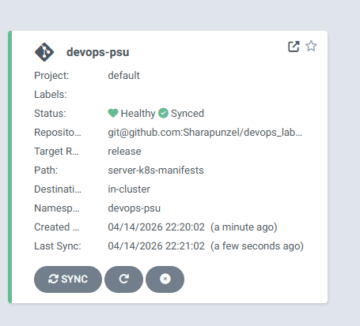